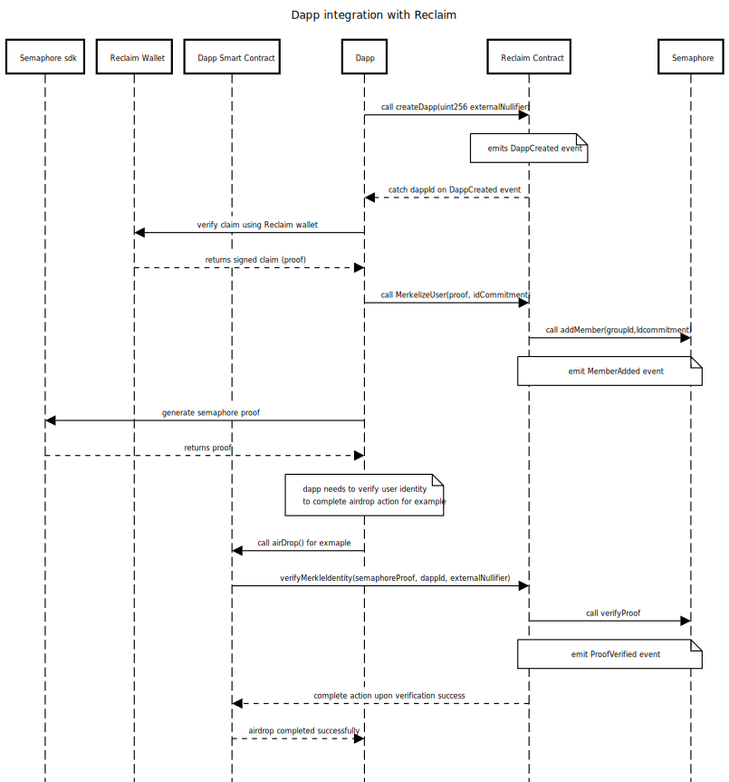

<div>
    <div>
        
    </div>
</div>

EVM smart contract that enables minting of credentials on-chain through a network of oracles and semaphore.

## Setup

1. Run `npm install --legacy-peer-deps`
2. To test, `npm run test`

## Contracts Addresses
 [Link to Contract Addresses](https://docs.reclaimprotocol.org/solidity/supported-networks)
## Commands

- `NETWORK={network} npx hardhat deploy` to deploy the Reclaim contract to a chain. `{network}` is the chain, for example, "eth-goerli" or "polygon-mainnet"
- `NETWORK={network} npx hardhat upgrade --address {proxy address of the Reclaim contract}` to upgrade the contract

- `npm run prettier` to lint your solidity files

# Dapp Integration with Reclaim Tutorial

## Introduction

This tutorial will guide you through the process of integrating a Dapp with Reclaim using Solidity and Ether.js. The integration involves verifying user claims and completing actions based on the user's identity.

## Prerequisites

Before you begin, make sure you have the following:

- Dapp ready with client app and smart contract
- Ether.js library to register dapp in reclaim contract

## Sequence Diagram



## Steps

Let’s imagine that you are building a DApp; your DApp will have two parts client and a smart contract

1. **Dapp Creation**

   - Your smart contract needs to be registered in Reclaim. Run the following script using to generate a DappId and Nullifier

     - `npx hardhat register-dapp --dapp-name {dapp-name} --network {NETWORK} ` where the `{dapp-name}` is the name of the dapp and `{NETWORK}` is the chain, for example, "eth-goerli" or "polygon-mainnet"

     ```ts
     import { task } from 'hardhat/config'
     import { getContractAddress } from './utils'
     import { Identity } from '@semaphore-protocol/identity'

     task('register-dapp')
       .addParam('dappName', 'name of the dapp you want to register')
       .setAction(async ({ dappName }, { ethers, upgrades, network }) => {
         const dappIdentity = new Identity(dappName)
         const { nullifier } = dappIdentity

         const reclaimFactory = await ethers.getContractFactory('Reclaim')
         const contractAddress = getContractAddress(network.name, 'Reclaim')
         const Reclaim = await reclaimFactory.attach(contractAddress)

         const createDappTranactionResponse = await Reclaim.createDapp(
           nullifier
         )

         const createDappTransactionReceipt =
           await createDappTranactionResponse.wait()

         const dappId = createDappTransactionReceipt.events![0]!.args![0]!

         console.log('External Nullifier:', nullifier)
         console.log('Dapp Id:', dappId)
       })
     ```

   - Dapp smart contract will need to store the dappId and the nullifier used to generate the dappId in order to call verifyMerkleIdentity later so, make sure that the contract store them.

     ```c#
     contract DappSmartContract{
         uint256 public externalNullifier;
         bytes32 public dappId;

        	constructor(uint256 _externalNullifier, bytes32 _dappId, address reclaimAddress){
           externalNullifier = _externalNullifier;
           dappId = _dappId;
           ....
     	}
     }
     ```

2. **Claim Verification**

   - Reclaim Wallet verifies a claim using the Reclaim Wallet or Reclaim SDK.
   - The user now generated the reclaim proof and can be used in the next step

3. **Merkelize User**

   - Before your dapp contract can verify a user identity, the user must submit a reclaim proof to Reclaim contract and be added to a merkel tree.
   - you must call this function within the onSuccess callback of proof generation on the frontend or after succefully receiving the proof.

   ```ts
   import { Identity } from '@semaphore-protocol/identity'
   import { useAccount } from 'wagmi'
   import { useContractWrite, usePrepareContractWrite } from 'wagmi'
   import RECLAIM from '../../contract-artifacts/Reclaim.json'
   import { useEffect, useState } from 'react'
   import { ethers } from 'ethers'
   import { Button, Spinner } from '@chakra-ui/react'

   export default function UserMerkelizer({ proofObj }: any) {
     const { address } = useAccount()
     const [identity, setIdentity] = useState<Identity>()

     useEffect(() => {
       if (!identity) {
         const newIdentity = new Identity(address)
         setIdentity(newIdentity)
         console.log('Generated new identity: ', newIdentity)
       }
     }, [identity])

     const proofReq = {
       claimInfo: {
         provider: proofObj.provider,
         context: proofObj.context,
         parameters: proofObj.parameters
       },
       signedClaim: {
         signatures: proofObj.signatures,
         claim: {
           identifier: proofObj.identifier,
           owner: ethers.computeAddress(`0x${proofObj.ownerPublicKey}`),
           timestampS: proofObj.timestampS,
           epoch: proofObj.epoch
         }
       }
     }

     const { config } = usePrepareContractWrite({
       enabled: !!identity,
       // @ts-expect-error events
       address: process.env.NEXT_PUBLIC_RECLAIM_CONTRACT_ADDRESS!,
       abi: RECLAIM.abi,
       functionName: 'merkelizeUser',
       args: [proofReq, identity?.commitment.toString()],
       chainId: 420,
       onSuccess(data) {
         console.log('Successful - register prepare: ', data)
         const provider = new ethers.providers.JsonRpcProvider('<YOUR_JSON_RPC_URL>');
         const signer = new ethers.Wallet('_KEY', provider);
         const contractAddress = '<YOUR_CONTRACT_ADDRESS>';
         const contractAbi = [<YOUR_CONTRACT_ABI>]; // Replace with your contract's ABI
         const contract = new ethers.Contract(contractAddress, contractAbi, signer);
         try {
            const tx = await contract.airDrop(data);
            await tx.wait();
            console.log('Transaction confirmed:', tx.hash);
          } catch (error) {
          console.error('Error sending data:', error);
          }
       },
       onError(error) {
         if (error.message.includes('AlreadyMerkelized')) {
           console.log('This user is already merkelized!!!!')
         } else {
           console.error(error)
         }
       }
     })

     const contractWrite = useContractWrite(config)

     return (
       <>
         {!contractWrite.isSuccess && (
           <>
             <Button
               colorScheme='primary'
               p='10'
               borderRadius='2xl'
               onClick={() => {
                 contractWrite.write?.()
               }}
             >
               Register Identity
             </Button>
             {contractWrite.isLoading && <Spinner />}
           </>
         )}
       </>
     )
   }
   ```

4. **Completing the Action**

   - Dapp Smart Contract calls `airDrop()` or any other relevant action.
   - the user will then submit the merkel proof to your contract. We recommend adding a non trivial time delay between calling merkelizeUser and submitting the proof to your contract. the more the time delay more the degree of anonymization
   - Dapp Smart Contract verifies the user's identity with the Reclaim Contract using `verifyMerkleIdentity(semaphoreProof, dappId, externalNullifier,...)`.
   - If successful, the Reclaim Contract completes the action and emits a `ProofVerified` event.
   - Dapp Smart Contract completes the airdrop action successfully.

   ```c#
       contract DappSmartContract{
           uint256 public externalNullifier;
           bytes32 public dappId;


           ReclaimInterface private Reclaim;
           .....

           funtion airDrop(
                   string memory provider,
                   uint256 _merkleTreeRoot,
                   uint256 _signal,
                   uint256 _nullifierHash,
                   uint256[8] calldata _proof
               ) external {
                   require(Reclaim.verifyMerkelIdentity(
                            provider,
                           _merkleTreeRoot,
                           _signal,
                           _nullifierHash,
                           _externalNullifier,
                           dappId,
                           _proof
                       ), "Proof not valid"
                       );
                   // continue action
               }
       }
   ```

   - Note: if Reclaim.verifyMerkleIdentity() call never reverted the airDrop will continue and the airDrop will completed successsfully, otherwise, airDrop will be reverted since something went wrong when verifying the identity.

## Notes

1. GroupId is calculated from the provider string:

```
function calculateGroupIdFromProvider(
		string memory provider
	) internal pure returns (uint256) {
		bytes memory providerBytes = bytes(provider);
		bytes memory hashedProvider = abi.encodePacked(keccak256(providerBytes));
		uint256 groupId = BytesUtils.bytesToUInt(hashedProvider, 32);
		return groupId;
	}
```

## Contributing to Our Project

We're excited that you're interested in contributing to our project! Before you get started, please take a moment to review the following guidelines.

## Code of Conduct

Please read and follow our [Code of Conduct](https://github.com/reclaimprotocol/.github/blob/main/Code-of-Conduct.md) to ensure a positive and inclusive environment for all contributors.

## Security

If you discover any security-related issues, please refer to our [Security Policy](https://github.com/reclaimprotocol/.github/blob/main/SECURITY.md) for information on how to responsibly disclose vulnerabilities.

## Contributor License Agreement

Before contributing to this project, please read and sign our [Contributor License Agreement (CLA)](https://github.com/reclaimprotocol/.github/blob/main/CLA.md).

## Indie Hackers

For Indie Hackers: [Check out our guidelines and potential grant opportunities](https://github.com/reclaimprotocol/.github/blob/main/Indie-Hackers.md)

## License

This project is licensed under a [custom license](https://github.com/reclaimprotocol/.github/blob/main/LICENSE). By contributing to this project, you agree that your contributions will be licensed under its terms.

Thank you for your contributions!
